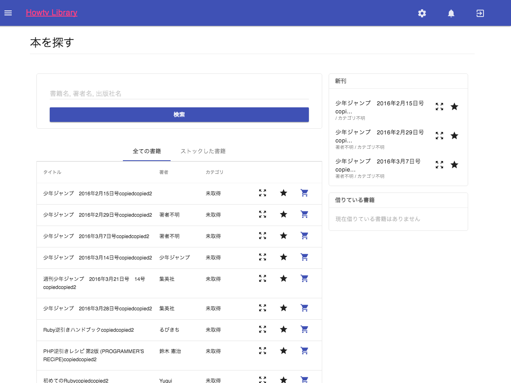
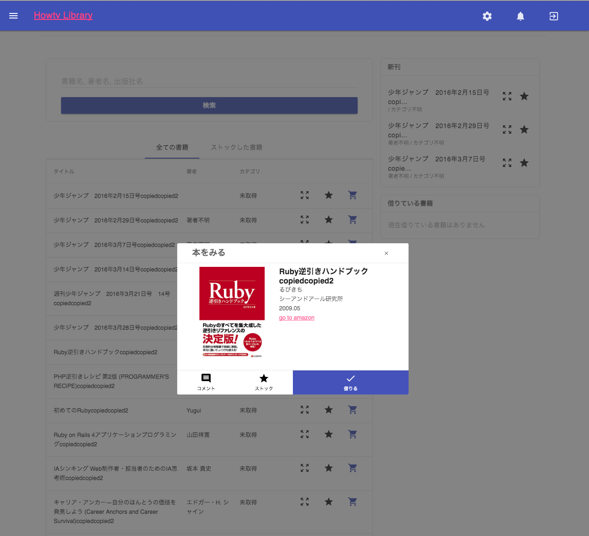

会社の書籍管理ツールとして土日につくったもの。
バーコードリーダーでISBNコードを読み込んだ後、ソレを元にamazonで書籍情報を取得してDBに突っ込んでいる。

TODO: 完成させたものはprivateレポジトリに入れちゃっているのであとで管理どうするか相談

# todo

- [ ] 書籍追加オペレーションを簡易化
- [ ] 返却遅延の一覧化
- [ ] ストック機能
- [ ] 通知いる？
